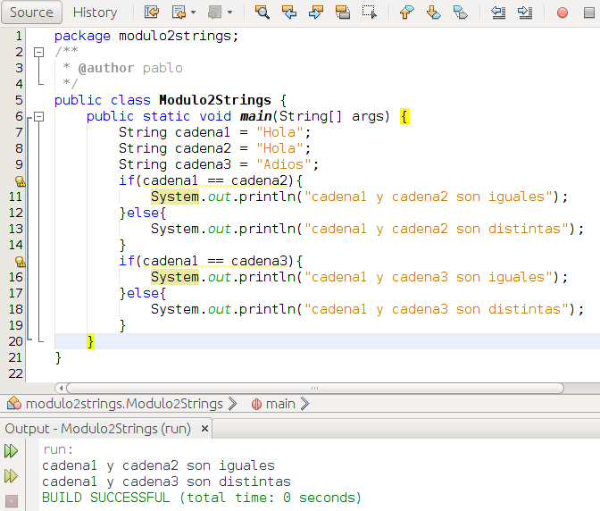
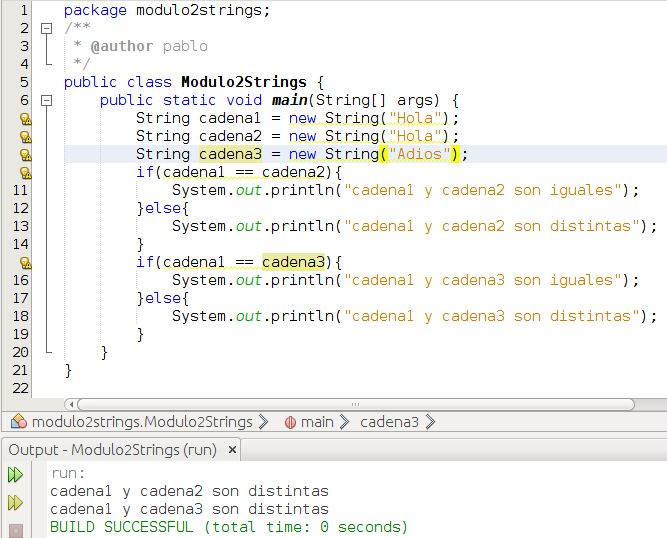
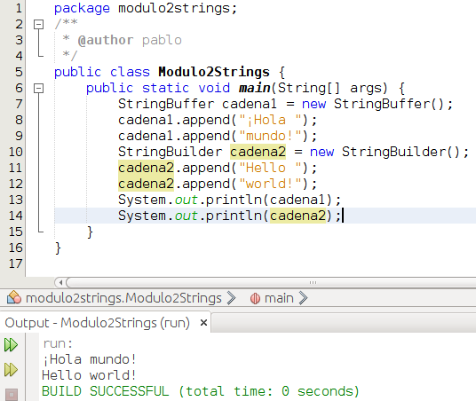

# Cadenas

# Cadenas

Hasta el momento hemos trabajado con cadenas (**String**) en alguna ocasión. Hemos mostrado por pantalla una cadena:

System.out.println("Hello world!");

Hemos definido una constante

final String CADENA = "a";// Declaramos una constante de tipo String y nombre CADENA y le asignamos el valor "a". Fíjate en que son comillas dobles.

y del mismo modo podríamos haber creado una variable:

String texto = "Hola mundo";// Declaramos una variablede tipo String y nombre textoy le asignamos el valor "Hola mundo". Fíjate en que son comillas dobles.

String no es un tipo primitivo, String es una clase por lo que cada vez que hacemos uso de ella estamos creando un objeto.

Como ya vimos en este módulo en el apartado de constantes y variables y como veremos en el siguiente módulo de este curso que cada vez que creamos un objeto lo hacemos con la sintaxis _Clase nombreVariable = new Clase();_. Sin embargo según acabo de indicar si utilizamos String estamos creando un objeto ¿entonces porque aquí no usamos new y hacemos la asignación directamente? Vamos a ver un par de ejemplos:

Ejemplo 1, sin new:

Ejemplo2, con new:

En el primer ejemplo, sin new, lo que ocurre es que cuando creamos la variable cadena1 se crea un espacio en memoria con el valor "Hola" y cuando creamos una nueva variable llamada cadena2 y decimos que valga "Hola" en vez de crearse un nuevo espacio en memoria se apunta al mismo, por eso, cuando se hace la comparación con == se comparan las zonas de memoria y al ser iguales nos dice que cadena1 es igual a cadena2. Sin embargo, en el 2º caso, al crear las variables cadena1 y cadena2 utilizando new estamos forzando a que cada variable (objeto) ocupe una zona de memoria distinta aunque tengan el mismo valor. Puede resultar confuso pero creo conveniente reseñar este caso especial ya que al tratarse de un objeto es mas que probable que nuestro alumnado nos pregunte por esta peculiaridad de este objeto. Esto no ocurre con ningún otro objeto.

En un entorno profesional no se usaría la clase String sino que se usarían las clases StringBuffer o StringBuilder (en función de las necesidades específicas). En el curso utilizaremos la clase String pero por curiosidad vamos a ver un ejemplo de código con estas clases:

