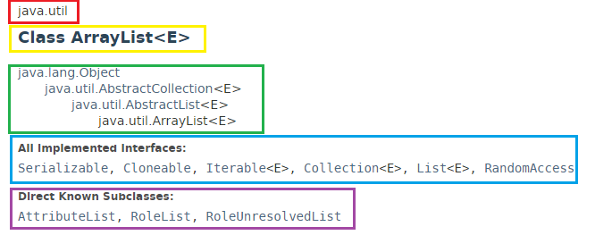

# Clases

Lo primero que vamos a hacer va a ser ver la **definición** que nos ofrece la wikipedia sobre lo que es una clase:

> En informática, una clase es una **plantilla para la creación de objetos** de datos según un modelo predefinido. Las clases se utilizan para representar entidades o conceptos, como los sustantivos en el lenguaje. **Cada clase** es un modelo que **define un conjunto de variables** -el estado, **y métodos** apropiados para operar con dichos datos -el comportamiento. Cada objeto creado a partir de la clase se denomina **instancia** de la clase.
> 
> Las clases son un pilar fundamental de la programación orientada a objetos. Permiten abstraer los datos y sus operaciones asociadas al modo de una caja negra. Los lenguajes de programación que soportan clases difieren sutilmente en su soporte para diversas características relacionadas con clases. La mayoría soportan diversas formas de **herencia**. Muchos lenguajes también soportan características para proporcionar **encapsulación**, como especificadores de acceso.
> 
> https://es.wikipedia.org/wiki/Clase_(inform%C3%A1tica)

En la definición he querido reseñar una serie de ideas clave:

*   Plantilla para la creación de objetos
*   Define variables y métodos.
*   A partir de la clase se crean los objetos. La clase se instancia para crear un objeto.
*   Java soporta herencia y encapsulación

Ahora que tenemos una definición de lo que es una clase vamos a ver cual es la **sintaxis** de la misma.

NombreClase{  
    sentencias del cuerpo de la clase  
}

Cuando he definido la sintaxis de una clase he indicado que en su interior existen las _sentencias del cuerpo de la clase_, ahora voy a afinar mas. **En Java las clases**, generalmente, **están formadas por una serie de atributos, constructores y métodos**:

*   **Atributos**: En caso de existir atributos (variables o constantes) estos pueden ser de tipo primitivo (int, float,...) o puede ser otro objeto (String, Coche, Integer,...).
*   **Constructores**: Son métodos especiales que nos van a permitir crear la instancia de nuestra clase. Todas las clases tienen sin excepción al menos 1 constructor, aunque no esté escrito en el programa.
*   **Métodos**: Es lo mismo que una función (las veíamos en el módulo 2) pero en este caso reciben este nombre cuando hablamos de objetos.

Como ya indicamos en el módulo anterior, el convenio establece que **la primera letra de una clase debe ser una letra mayúscula**. Personalmente, cuando creo una clase lo hago en el orden que he indicado en la lista anterior. Primero escribo los atributos, a continuación los constructores y después los métodos.

Hasta aquí fácil, ¿verdad? Pues bien, a esta sintaxis básica (que ya habíamos utilizado) le iremos añadiendo una serie de modificadores como public, final, extend y/o implements para ir poco a poco avanzando en nuestros programas.

En Java existe una **jerarquía de clases** en la que **todas las clases derivan de una clase llamada [Object](https://docs.oracle.com/javase/8/docs/api/java/lang/Object.html "Object")**. Si miramos la documentación de cualquier clase veremos que todas, sin excepción, derivan de ella. **Cuando una clase extiende a otra hereda todas las variables y métodos de la superclase (clase de la que hereda)**.

A continuación voy a poner una imagen de la jerarquía de clases de la clase [ArrayList](http://docs.oracle.com/javase/8/docs/api/java/util/ArrayList.html) según obtenemos de la propia documentación:

Lo anterior es una captura de pantalla de la documentación de la clase ArrayList. 

*   En rojo aparece el paquete al que pertenece la clase
*   En amarillo el nombre de la clase
*   En verde la jerarquía de clases. ArrayList hereda de AbstractList que a su vez hereda de AbstractCollecion que a su vez hereda de Object. Hablaremos de la herencia mas adelante.
*   En azul vemos las interfaces que implementa la clase. Hablaremos de las interfaces mas adelante.
*   En morado vemos las clases que son descendiente de la clase ArrayList.

En caso de no poder distinguir los colores, la explicación sigue el orden de los recuadros. Es decir, el primer recuadro es el rojo, el segundo el amarillo,...

Para terminar con este apartado voy a enumerar los distintos **tipos de clases** existentes.

*   **Públicas.**
*   **Abstractas.**
*   **Finales.**

Existe una cuarta opción que es la de no poner modificar a la clase.

Profundizaremos en los tipos de clases en el apartado control de acceso.

