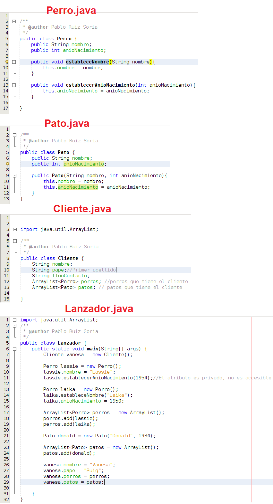
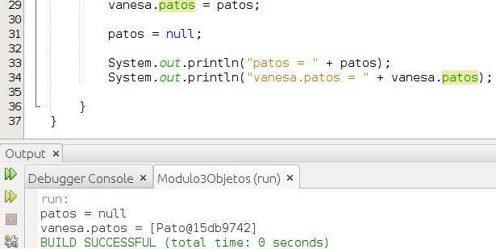
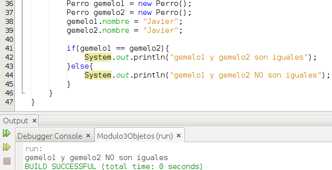

# Creando objetos

# Creando objetos

Cuando queremos **acceder a un atributo** de una determinada clase debemos hacerlo utilizando la siguiente sintáxis:

nombreObjeto.nombreAtributo;

Del mismo modo procederemos cuando a lo que queramos **acceder** sea al **método** de un objeto:

nombreObjeto.nombreMetodo(parámetros);

Lo anterior estará permitido siempre y cuando tengamos el control de acceso adecuado para el atributo o método o cuestión. Sobre el control de acceso os hablaré un poco mas adelante en este módulo, de momento vamos a considerar que no existen estas limitaciones.

Vamos a ver un ejemplo:

En el ejemplo anterior tenemos 4 clases Perro, Pato, Cliente y Lanzador. Vamos a centrarnos en la clase Lanzador que es la que contiene la función main y es en ella donde ocurre la acción. En las líneas 7, 9, 13, 17, 21 y 23 creamos objetos, fíjate que para ello siempre hacemos uso de la palabra reservada new. En las líneas 10, 15 y 26 a 29 accedemos a los atributos de los objetos en cuestión. En las líneas 11, 14, 18, 19 y 24 accedemos a los métodos de los objetos. Aunque en este ejemplo hayamos accedido a los atributos de este modo no es lo adecuado, generalmente se hará uso del **encapsulamiento**, pero de esto hablaremos mas adelante.

¿Y si sobre el ejemplo anterior quisiésemos acceder al nombre del primer perro de la cliente Vanesa? Pues haríamos lo siguiente:

String nombreDelPrimerPerroDeVanesa = vanesa.perros.get(0).nombre;

La sentencia anterior es un poco peligrosa y evitaremos utilizarla si antes no hacemos una serie de comprobaciones o incluimos la misma en un bloque try-catch para controlar las excepciones.

En Lanzador.java vamos a decir que ahora la variable patos valga nulo. Con ella está claro que pasará a valer nulo, pero ¿qué pasará con vanesa.patos que hemos dicho que valga lo que vale esa variable?

Lo que ocurre en la línea 29 es que al atributo patos del objeto vanesa le decimos que pase a apuntar a la misma zona de memoria que apunta la variable patos. Posteriormente decimos en la línea 31 que la variable patos que apuntaba a una determinada zona de memoria pase a no apuntar a ningún sitio (null) pero eso no afecta en que el atributo patos del objeto vanesa cambie su valor. Lo podemos ver en el resultado que aparece en consola (\[Pato@15db9742\] es la dirección de memoria que la JRE le asigna al objeto)

Otra duda, si creo 2 objetos cuyos atributos tengan exactamente los mismos valores, ¿qué pasará?

Lo que ocurre es que gemelo1 y gemelo2 apuntan a zonas de memoria distintas por eso el compilador nos dice que los objetos son distintos.

**En Java para comparar objetos utilizaremos el método equals.** Todos los objetos tienen dicho método puesto que en Java todas las clases derivan de la clase [Object](https://docs.oracle.com/javase/8/docs/api/java/lang/Object.html "Object") y la clase Object tiene este método. Ahora bien, para que equals funcione del modo esperado deberemos sobreescribir el método en nuestra Clase, lo veremos en el apartado de herencia.

Cuando tratamos de acceder a un atributo o método de un objeto y el objeto no apunta a ninguna zona (es nulo) obtendremos una excepción de tipo [NullPointerException](https://docs.oracle.com/javase/8/docs/api/java/lang/NullPointerException.html "NullPointerException") por lo que antes de acceder a un objeto deberemos realizar las comprobaciones necesarias para evitar este error.

