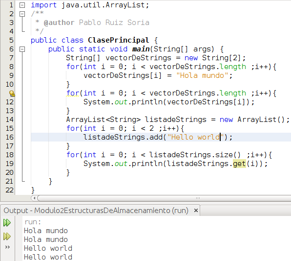
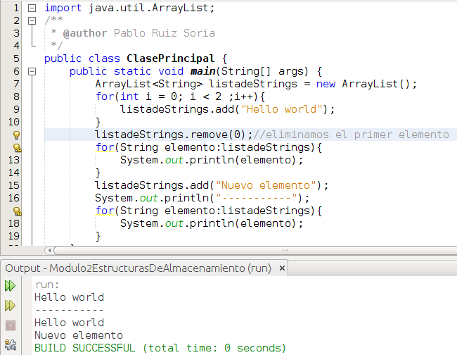

# Estructuras de almacenamiento de datos

# Estructuras de almacenamiento de datos

Antes de comenzar vamos a conocer la definición que de **estructura de datos** ofrece la wikipedia:

> En programación, una estructura de datos es una forma particular de organizar datos en una computadora para que pueda ser utilizado de manera eficiente.
> 
> https://es.wikipedia.org/wiki/Estructura\_de\_datos

En capítulos anteriores ya hemos trabajado con una estructura de datos, los **Arrays** (los cuales nos permitían almacenar datos en **vectores**).

Trabajar con Arrays puede ser suficiente para nuestras prácticas de aula pero conviene conocer las interfaces [List](http://docs.oracle.com/javase/8/docs/api/java/util/List.html "List"), [Map](https://docs.oracle.com/javase/8/docs/api/java/util/Map.html "Map") y [Set](http://docs.oracle.com/javase/8/docs/api/java/util/Set.html). En el siguiente módulo del curso veremos que es una interface pero ahora nos interesan conocer algunas implementaciones de las interfaces antes mencionadas. [ArrayList](http://docs.oracle.com/javase/8/docs/api/java/util/ArrayList.html "ArrayList"), [HashMap](https://docs.oracle.com/javase/8/docs/api/java/util/HashMap.html "HashMap") y [HashSet](https://docs.oracle.com/javase/8/docs/api/java/util/HashSet.html "HashSet") son, respectivamente, algunas de las implementaciones de estas interfaces.

Vamos a ver para que usar cada una de estas estructuras de datos:

*   **Arrays (vectores)**: Es la forma mas eficiente de almacenar objetos pero una vez defines el tamaño del vector no puedes ampliarlo o reducirlo. Además no puedes guardar variables de distinto tipo
*   **List**: Almacena las variables en el orden en que se insertan. Nos permite tener valores duplicados en la lista. Nos permite tener variables de distinto tipo (al declararla no pondremos <Tipo> como en nuestro ejemplo)
*   **Map**: No almacena el orden en que se insertan los datos (algunas de sus implementaciones si lo hacen). Para almacenar los datos se hacen usando el par clave-valor. No permite valores de clave repetidos pero si valores de valor repetidos. Nos permite tener variables de distinto tipo.
*   **Set**: No almacena el orden en que se insertan los datos (algunas de sus implementaciones si lo hacen). No permite valores duplicados. Nos permite tener variables de distinto tipo. Es lo que debemos elegir si no queremos tener elementos repetidos en nuestra estructura de datos.

En este capítulos vamos a centrarnos en la clase **ArrayList**, vamos a ver un ejemplo:

Lo primero que vemos en la línea 1 es que para trabajar con la clase ArrayList hay que importarla. Entre las líneas 7 y 13 tenemos un ejemplo de como trabajar con Arrays (ya lo vimos con anterioridad). En la línea 14 nos encontramos con la creación de una variable llamada listadeStrings que es de tipo ArrayList y además le añadimos <String> lo cual significa que en este ArrayList solo vamos a poder almacenar variables de tipo String. La primera diferencia con respecto a los Arrays es que aquí no definimos el tamaño del ArrayList. Esto es porque los ArrayList, a diferencia de los Arrays, son dinámicos. Podemos variar su tamaño en tiempo de ejecución según nuestras necesidades. En la línea 16 vemos como añadir un elemento a nuestro ArrayList. En la línea 18 vemos que para obtener el tamaño de un ArrayList utilizamos el método size. Y en la línea 19 vemos que para obtener una determinada posición de un ArrayList utilizamos el método get. Al igual que los en los Array, en los ArrayList se comienza a contar por 0. Hemos comentado anteriormente que los ArrayList son dinámicos por lo que en el ejemplo anterior podríamos añadir un tercer elemento a la lista sin necesidad de crear otra variable nueva, sin embargo, no podríamos hacerlo con el Array.

A continuación vamos a ver como quedaría el ejemplo anterior eliminando la parte relativa a los arrays y utilizando for mejorados para recorrer el ArrayList:

Lo relevante del código anterior lo encontramos en la línea 11 donde hacemos uso del método remove que nos permite borrar el elemento de la lista que nos interese. En la línea 12 y 17 nos encontramos con unos bucles for distintos a los que habíamos utilizado hasta la fecha. En estos bucles for lo que decimos es que extraiga cada vez el siguiente elemento de la lista y lo guarde en una variable llamada elemento de tipo String.

