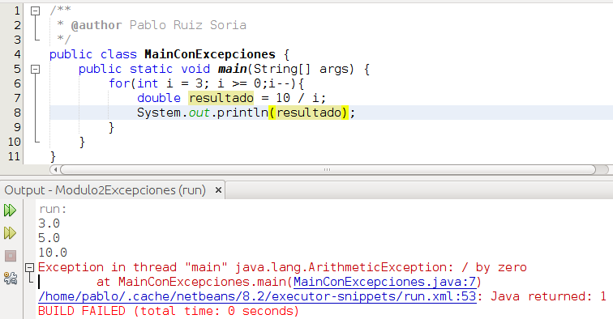
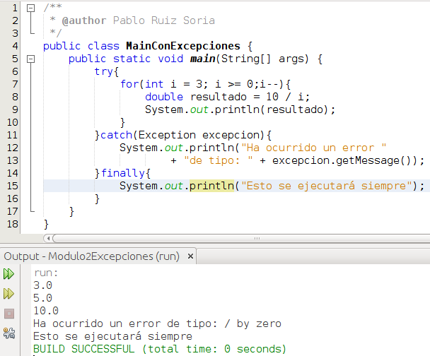
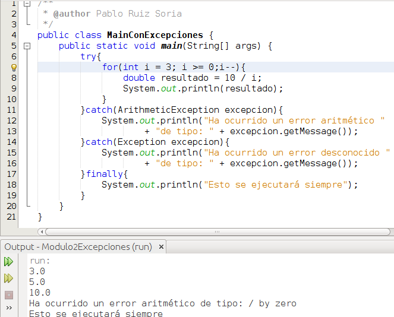
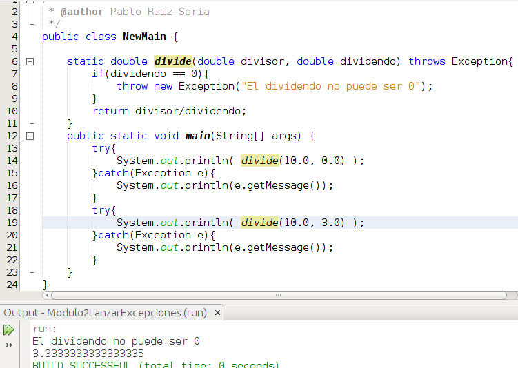

# Excepciones

# Excepciones

En Java, las excepciones son una clase ([documentación](https://docs.oracle.com/javase/8/docs/api/java/lang/Exception.html "Java Exception")) que se lanza cuando ocurre un error en [tiempo de ejecución](https://es.wikipedia.org/wiki/Tiempo_de_ejecuci%C3%B3n "Tiempo de ejecución"). Es decir, no son errores de compilación de algo que hemos escrito mal y el compilador no comprende sino que son errores que ocurren mientras nuestro programa está siendo usado. Java nos ofrece la posibilidad de controlar estos errores y recuperarnos de ellos sin abortar la ejecución de nuestro programa.

Vamos a ver un ejemplo:

Lo que vemos aquí es que el programa compila y se ejecuta sin mayor problema pero durante su ejecución se intenta realizar una división por 0 y se lanza una excepción (ArithmeticException) con el error, nos indica en que línea de nuestro código ocurre (línea 7) y se detiene la ejecución del programa. En un entorno real no sería tolerable que aunque una de las muchas cosas que pueden fallar el programa se detenga, por ello lo que hay que hacer es controlar la excepción y que el programa continúe su ejecución. Vamos a ver como contener el error:

Lo que hacemos aquí es crear un bloque try-catch-finally. Dentro del try le decimos lo que queremos que haga y si hay algún error de tipo Exception lo capturamos y hacemos lo que está dentro del catch. El bloque finally es opcional y es un trozo de código que se ejecutará siempre falle o no la ejecución en el bloque try. Todas las excepciones, como [ArithmeticException](http://docs.oracle.com/javase/8/docs/api/java/lang/ArithmeticException.html), derivan de Exception por eso si en un bloque catch capturamos Exception capturaremos cualquier excepción. Es muy cómodo capturar cualquier excepción en un bloque catch pero lo idea es poner un bloque catch para cada excepción y así saber que falla concretamente. Vamos a ver un ejemplo:

En el código anterior aparecen 2 bloques catch, en el primero de ellos (línea 11) controlo las excepciones que pudiesen ocurrir de tipo aritmético y en el segundo bloque (línea 14) capturo cualquier otro tipo de excepción.

En ocasiones puede resultarnos útil lanzar nosotros mismos un error bien de tiempo genérico (Exception) o bien extendiendo la clase Exception para crearnos nuestro error personalizado. Dado que aún no hemos visto como extender una clase vamos a ver a continuación un trozo de código donde lancemos una excepción genérica:

En la imagen anterior vemos que creamos una función en la línea 6 que realiza la división de 2 parámetros. En la línea 7 comprobamos que el dividendo no sea 0 ya que no se puede dividir por 0. En caso de que el dividendo sea 0 en la línea 8 lanzamos una excepción (realmente un objeto realmente que inicializamos con su constructor, veremos estos conceptos en el siguiente módulo) con un mensaje personalizado.  Como dentro de nuestra función lanzamos una excepción tenemos que indicar de algún modo que este módulo lanza excepciones de tipo Excepcion, por ello en la línea 6 añadimos a nuestra función throws Exception. En el mail lo único que hago es mostrar por pantalla el resultado de llamar a esta función. En el primer caso vemos que entra al catch (línea 15) mientras que en el segundo caso al no lanzarse ninguna excepción no se ejecuta el código contenido en el catch. Ninguno de estos try-catch incluye el bloque finally que como dijimos anteriormente es opcional.

