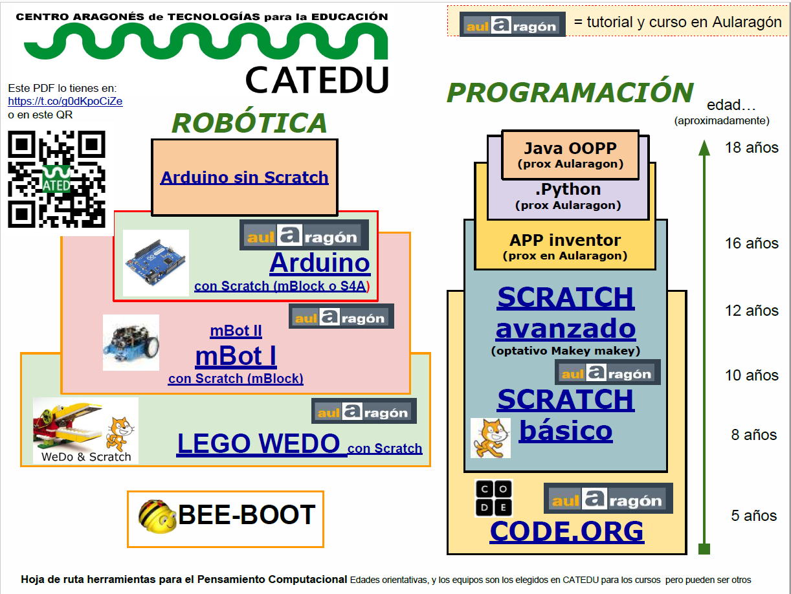

En este primer módulo vamos a conocer que es Java y sus características principales. Además vamos a crear nuestro primer programa (lo cual derivará en otras necesidades que veremos entonces) y vamos a conocer donde obtener mas información sobre Java para complementar este curso.

En el siguiente esquema elaborado por el CATEDU podemos ubicar el lenguaje Java como un lenguaje ideal para abarcar el curriculo relativo a programación en alumnado a partir de 15-16 años.

