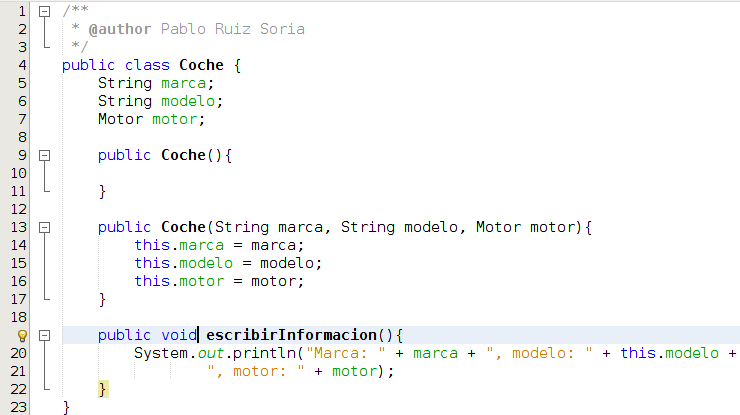
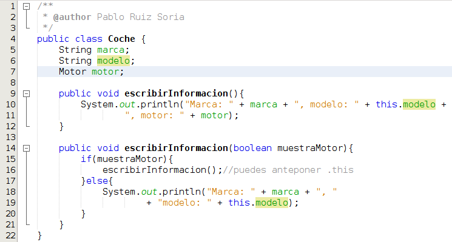

# Métodos

En el módulo 2 de este curso estuvimos hablando de las funciones. **Un método es** básicamente **lo mismo que una función pero asociado a un objeto**. Cuando en el siguiente apartado de este módulo hablemos de la palabra reservada static espero aclarar mejor esta diferenciación.

La sintaxis es básicamente la misma que en las funciones.

Vamos a ver un ejemplo:

En el ejemplo anterior aparece un método entre las líneas 19 y 22. El método es de acceso público (public), no devuelve nada (void), se llama escribirInformacion y no tiene parámetros. El método tiene una única sentencia que ocupa las líneas 20 y 21 y que muestra por pantalla un texto. Fíjate que puedes acceder a los atributos de la clase con o sin this.

En Java, **dentro de una clase puedes tener 2 métodos que se llamen igual siempre y cuando el número de parámetros que utilicen o el tipo varíe**. A continuación tenemos un ejemplo:

En el ejemplo anterior vemos que dentro de la misma clase tenemos 2 métodos que se llaman igual (escribirInformacion. Podemos tenerlos porque en la línea 9 definimos uno de ellos sin parámetros y en la línea 14 definimos otro con un solo parámetro de tipo boolean. Podríamos tener otro mas de un solo parámetro siempre y cuando este no fuera de tipo boolean.

En Java existe la [**sobreescritura de métodos**](https://es.wikipedia.org/wiki/Herencia_(inform%C3%A1tica)#Redefinici.C3.B3n_de_m.C3.A9todos "Sobreescritura de métodos"). Esto significa que cuando una clase hereda de otra se puede sobreescribir los métodos de esta. Lo veremos con mas detalle en el apartado de herencia.

Si eres observador/a te habrás dado cuenta de que cuando creo un método no uso la palabra reservada static como hacía con las funciones, en el siguiente capítulo voy a tratar de explicarte el porqué.

